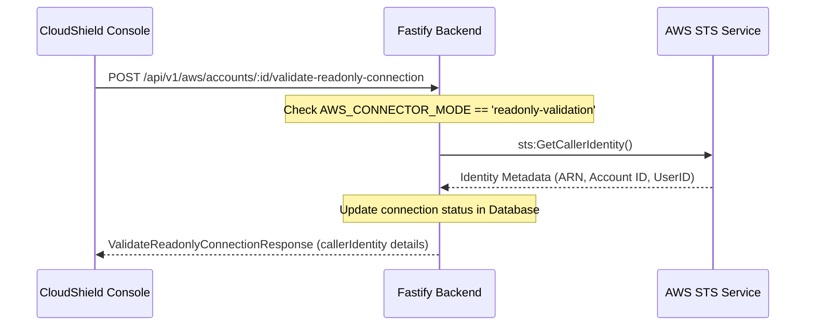

# Real AWS Integration Architecture

This document describes CloudShield's real-world read-only integration, identity validation architecture, resource ingestion flows, and backend database mappings.

## 1. STS Identity Validation (Phase A)

Identity verification is implemented in [AwsConnectorService](file:///C:/CloudShield/apps/backend/src/modules/aws-connector/aws-connector.service.ts).

* **API Executed**: `sts:GetCallerIdentity`
* **Safety parameters**: No credentials are stored. No write permissions are requested.
* **Blocked states**: If `AWS_CONNECTOR_MODE` is disabled, the call is blocked, returning `awsApiCallExecuted=false`.

## 2. EC2 Ingestion Scan (Phase B)

Scanning is orchestrated via BullMQ worker [executeEc2Scan](file:///C:/CloudShield/apps/worker/src/aws-ec2-scanner.ts).

* **APIs Executed**:
  - `ec2:DescribeInstances`
  - `ec2:DescribeSecurityGroups`
  - `ec2:DescribeVolumes`
  - `ec2:DescribeVpcs`
  - `ec2:DescribeSubnets`
* **Worker Security Checks**: The worker reads its environment variables (`AWS_CONNECTOR_MODE` and `AWS_INVENTORY_SCANNER_MODE`) directly from `process.env` rather than trusting the job payload, avoiding execution escalation vulnerabilities.

## 3. Database Ingestion Mapping

Ingested AWS entities are written/upserted as `CloudResource` records:
* **Instances**: `EC2_INSTANCE`
* **Security Groups**: `SECURITY_GROUP`
* **EBS Volumes**: `EBS_VOLUME`
* **VPCs**: `VPC`
* **Subnets**: `SUBNET`

Resource relationships are parsed and populated as `ResourceRelationship` records:
* `RESIDES_IN` (Instance &rarr; Subnet, Instance &rarr; VPC, Subnet &rarr; VPC)
* `ASSOCIATED_WITH` (Instance &rarr; Security Group)
* `ATTACHED_TO` (Volume &rarr; Instance)

## 4. Automatic Post-Scan Posture Evaluation

Upon successful completion of an inventory scan, the worker triggers `evaluateSecurityRules(organizationId)` automatically. This evaluates all deterministic security group, IP, and volume encryption posture policies against the stored resources, generating new findings and linking them to governance `Recommendation` actions in a single pipeline.
# Current Phase 1 Read-only Inventory Boundary

CloudShield now supports a controlled account-scoped read-only inventory sync at `POST /api/v1/aws/accounts/:accountId/inventory/sync`. It is disabled by default and requires `AWS_CONNECTOR_MODE=readonly-validation` or `sts-validation` plus `AWS_INVENTORY_SCANNER_MODE=readonly`.

The Phase 1 allowlist is limited to `sts:GetCallerIdentity`, `ec2:DescribeRegions`, `ec2:DescribeVpcs`, `ec2:DescribeSubnets`, `ec2:DescribeSecurityGroups`, `ec2:DescribeInstances`, and `ec2:DescribeVolumes`. No IAM inventory, S3 inventory, mutation API, Terraform apply, or automatic remediation execution is included.
